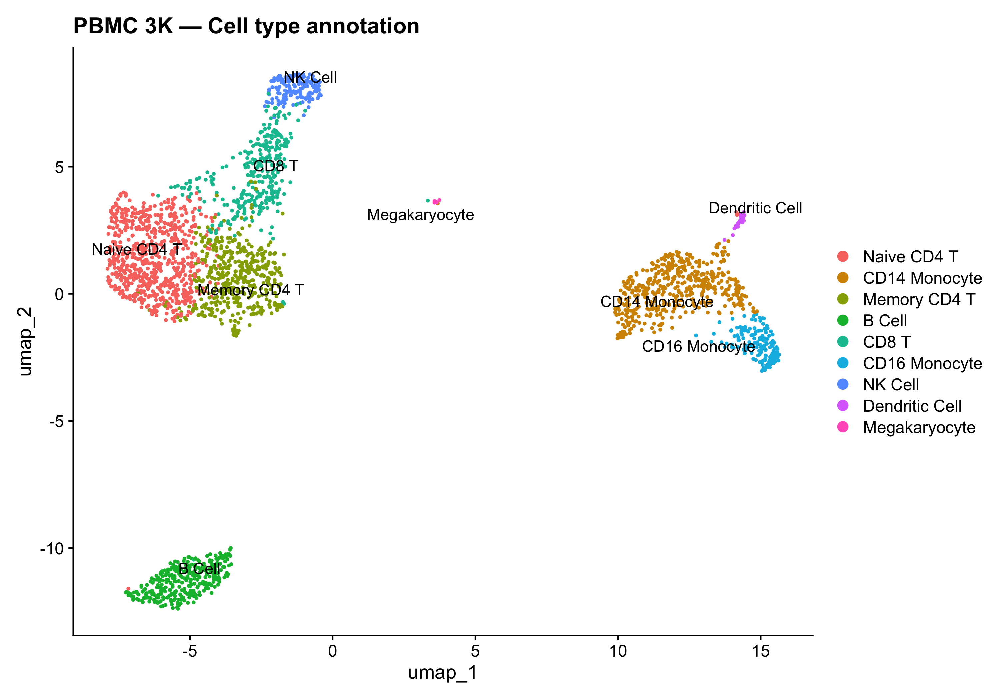

# scRNA-seq Analysis of Human PBMCs using Seurat

End-to-end single-cell RNA-seq pipeline built in R identifying 8 immune
cell populations from 2,700 human peripheral blood mononuclear cells
(PBMCs) using the 10x Genomics PBMC 3K dataset.



------------------------------------------------------------------------

## Overview

This project demonstrates a complete scRNA-seq analysis workflow using
**Seurat v5**, covering quality control, normalization, dimensionality
reduction, graph-based clustering, differential expression, and manual
cell type annotation. The full analysis is written as a reproducible R
Markdown document that knits to a self-contained HTML report.

------------------------------------------------------------------------

## Dataset

| Property | Detail |
|------------------------------------|------------------------------------|
| Source | [10x Genomics PBMC 3K](https://www.10xgenomics.com/datasets/3-k-pb-mcs-from-a-healthy-donor-1-standard-1-1-0) |
| Organism | *Homo sapiens* |
| Tissue | Peripheral blood |
| Cells (raw) | 2,700 |
| Format | 10x MEX (matrix.mtx, barcodes.tsv, genes.tsv) |

------------------------------------------------------------------------

## Methods Summary

| Step | Tool / Parameter |
|------------------------------------|------------------------------------|
| QC filtering | nFeature 200–2500, percent.mt \< 5% |
| Normalization | LogNormalize, scale factor 10,000 |
| Feature selection | Top 2,000 HVGs via VST |
| Scaling | z-score + regress out percent.mt |
| Dimensionality reduction | PCA (top 10 PCs) + UMAP |
| Clustering | KNN graph + Louvain, resolution 0.5 |
| Marker identification | Wilcoxon rank-sum, min.pct = 0.25, log2FC \> 0.25 |
| Annotation | Manual using canonical marker genes |

------------------------------------------------------------------------

## Cell Types Identified

| Cluster | Cell Type      | Key Markers   |
|---------|----------------|---------------|
| 0       | Naive CD4 T    | IL7R, CCR7    |
| 1       | CD14 Monocyte  | CD14, LYZ     |
| 2       | Memory CD4 T   | IL7R, S100A4  |
| 3       | B Cell         | MS4A1, CD79A  |
| 4       | CD8 T          | CD8A          |
| 5       | CD16 Monocyte  | FCGR3A, MS4A7 |
| 6       | NK Cell        | GNLY, NKG7    |
| 7       | Dendritic Cell | FCER1A, CST3  |
| 8       | Megakaryocyte  | PPBP          |

------------------------------------------------------------------------

## Repository Structure

```         
scRNA-PBMC-Seurat/
├── R/
│   ├── pbmc_analysis.Rmd     # full annotated analysis
│   └── pbmc_analysis.html    # knitted HTML report
├── data/
│   └── all_cluster_markers.csv
├── docs/
│   └── index.html            # GitHub Pages report
├── figures/                  # all saved plots (11 .png files)
├── .gitignore
└── README.md
```

> Raw 10x data and `.rds` files are excluded via `.gitignore` (too large
> for GitHub). Download the dataset from the link above and place it at
> `data/filtered_gene_bc_matrices/hg19/` to reproduce the analysis.

------------------------------------------------------------------------

## How to Reproduce

### 1. Clone the repository

``` bash
git clone https://github.com/Cynric07/scRNA-PBMC-Seurat.git
cd scRNA-PBMC-Seurat
```

### 2. Download the data

``` bash
cd data
curl -O https://cf.10xgenomics.com/samples/cell/pbmc3k/pbmc3k_filtered_gene_bc_matrices.tar.gz
tar -xzf pbmc3k_filtered_gene_bc_matrices.tar.gz
```

### 3. Install dependencies

``` r
install.packages(c("Seurat", "tidyverse", "patchwork"))
```

### 4. Knit the report

``` r
rmarkdown::render("R/pbmc_analysis.Rmd")
```

This runs the full pipeline, saves all figures to `figures/`, and
produces the HTML report.

------------------------------------------------------------------------

## Key Figures

| Figure                 | Description                                        |
|------------------------|----------------------------------------------------|
| `qc-violin-1.png`      | QC metric distributions before filtering           |
| `elbow-1.png`          | Variance explained per PC — justifies 10 PC cutoff |
| `umap-plot-1.png`      | Raw Louvain clusters on UMAP embedding             |
| `feature-plots-1.png`  | Known cell-type markers overlaid on UMAP           |
| `umap-annotated-1.png` | Final annotated cell type map                      |
| `heatmap-1.png`        | Top 10 DEGs per cluster                            |

------------------------------------------------------------------------

## Tools & Versions

See `session_info.txt` for the full R session including all package
versions used in this analysis.

| Tool      | Version |
|-----------|---------|
| R         | 4.x     |
| Seurat    | 5.x     |
| tidyverse | 2.x     |
| patchwork | 1.x     |

------------------------------------------------------------------------

## References

-   Hao Y. et al. (2021). *Integrated analysis of multimodal single-cell
    data.* Cell.
    [doi:10.1016/j.cell.2021.04.048](https://doi.org/10.1016/j.cell.2021.04.048)
-   10x Genomics PBMC 3K dataset:
    <https://www.10xgenomics.com/datasets/3-k-pb-mcs-from-a-healthy-donor-1-standard-1-1-0>

------------------------------------------------------------------------

## License

MIT © [Your Name]
